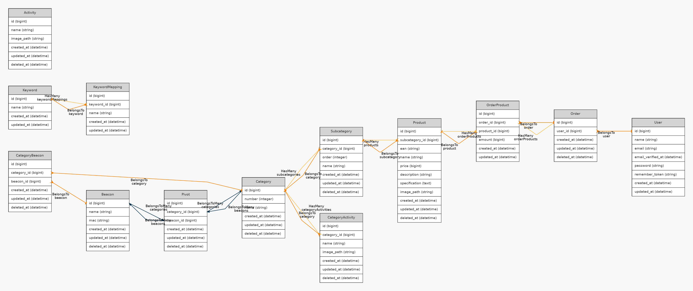

# 賣場導引與後台管理系統

此為賣場導引與後台管理系統的後端。

# 介紹
## 動機
中型量販店在近年來的發展突飛猛進，當消費者在一次需要購買多量且不同種類商品時，中型量販店通常是他們最方便的選擇。在中型量販店之中，店家會引進種類繁多的商品，例如文具、衣物、小型家電、零食等。

前往中型量販店的消費者，有時會需要找尋多個商品，但中型量販店在追求商品多樣化的同時也衍伸出了幾個問題。琳瑯滿目的商品除了會讓店內的擺設略顯擁擠雜亂之外，也讓消費者時常摸不著頭緒，不知道開從何處開始找尋需要的商品。

為此，希望能設計出能讓消費者在中型量販店可以更加便捷的找到商品的導航功能，以及增加商品推播功能，讓消費者在進入賣場後能快速地找到商品和有優惠的商品。

## 目的
- 一個提供商家管理商品和推薦項目的後台系統。

# 系統組織架構

- 系統平台
	- 用戶端: APP
	- 商家管理: Web
	- 藍芽裝置: Beacon

- 提供服務
	- 商品資訊查詢與操作
		- 基本商品操作
	- 商品推薦
        - 購買烤肉的客戶可能還會購買衛生紙，當購買特定商品時，會推薦指定商品
		- 藉由紀錄各個商品所屬的類別，APP 端在取得商品時會包含推薦商品的資料
	- 商品位置導航
        - APP 端可以藉由藍芽裝置 Beacon 得知目前所在的產品類別，並且可以使用導航功能導航至商品所在位置
        - 藉由紀錄藍芽裝置 Beacon 的編號與所在商品類別編號，提供給 APP 端使用
		
# 用戶端介面介紹
## 首頁
首頁是一個將主要的大方向功能呈現的地方，簡潔的介面可以得知此網頁為賣場管理介面。可以看到目前有兩個選項，分別是進入管理界面與API的連結目錄。接下來先提及有關管理界面的內容。

## 用戶認證
當點選管理界面後，會移動至用戶認證的界面。因為涉及到修改內容的部份，因此需要有帳密制度進行管控，以防不夠權限的人去進行修改。主要採用E-mail和密碼進行驗證。選擇E-mail作為帳戶名稱主要是因應現代人通常人手一個E-mail，可以方便創建用戶。

## 管理界面共同區域
上方的橫列可以連結到其他的管理界面，而最後的登出可以退出登入狀態至首頁。
而下方的建立按鈕可以去新增資料，每一列欄位的編輯按鈕則可以移動至修改與刪除的界面。

## 商品管理(大分類)新增
新增分類的編號以及相應的名稱。編號主要是大看板上的編號。通常編號以及名稱可以提供用戶進行識別。在新增了大分類後才可以使用其他諸如小分類、大分類活動、大分類Beacon等功能，原因是這三者都相依於大分類，大分類得先有數值才可以做進一步處理。
 

## 活動管理
能夠呈現出所有的活動，具有相應的名稱以及圖片。活動主要是綜合活動，跟其他內容的關係來說較為獨立。通常是使用於APP首頁需要呈現的圖片，而名稱可以供使用者端進行辨識或是呈現，亦或是在公告訊息流轉。

## API
由於Chrome瀏覽器直接取得的JSON格式，人類難以觀察，因此將其格式化後使用。
API首頁
可以看見目前所撰寫供人使用的API，左邊是資源的列表，右邊則是對應的網址。此頁面就像是API的使用手冊一樣，可以供使用者端查詢目前已有哪些API可以使用。

# 框架
Laravel 6.2

# UML

